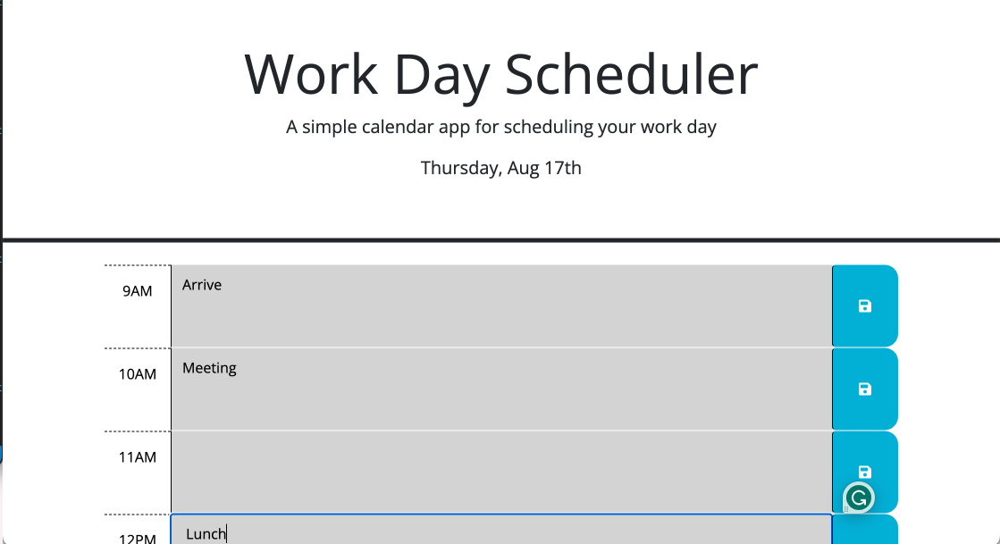

# Work Day Scheduler Challenge

## Description
This webpage was built to demonstrate my knowledge of JavaScript, web APIs and third-party APIs. After adjusting the HTML and adding JavaScript to pre-existing code, this webpage can now be used as a day scheduler which keeps user input tasks in the local storage. 

## Installation
N/A

## Usage
This webpage can be used to keep track of tasks during a work day. 
https://rileysong01.github.io/work-day-scheduler/

## Credits 
N/A

## License
PLease refer to the LICENSE in the repo

* The URL of the GitHub repository, with a unique name and a README describing the project

- - -
© 2023 edX Boot Camps LLC. Confidential and Proprietary. All Rights Reserved.
